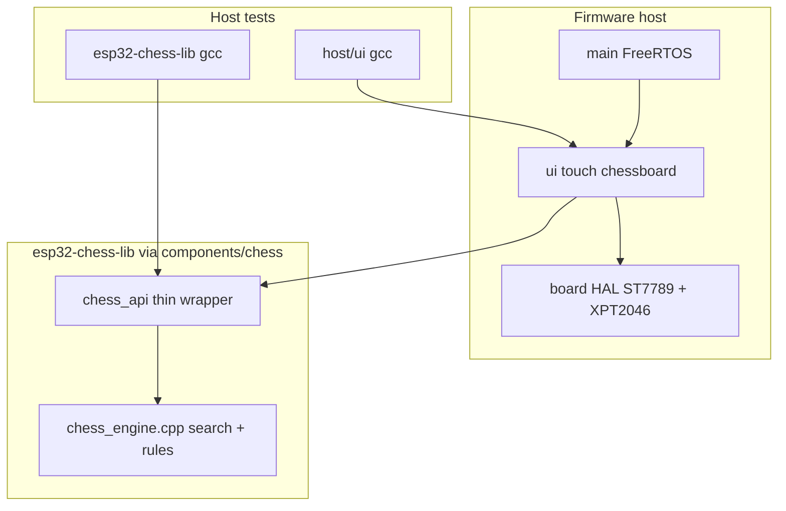

# ESP32 Chess on CYD — high-level plan

**This file:** `/home/davidl/Projects/esp32-chess/PLAN.md` (repo root; canonical living plan).

Work it interactively. **Do not start a step until we agree it.**
After each discussion, update decisions and step status here.
**Commit after each completed step** (one commit per step going forward).

Statuses: `todo` · `discuss` · `agreed` · `in progress` · `done`

---

## What we’re integrating

| Piece | Reality |
|---|---|
| Board | [`../esp32-invaders/docs/boards/esp32-2432s028r/BOARD.md`](../esp32-invaders/docs/boards/esp32-2432s028r/BOARD.md) — classic ESP32, **ST7789** 320×240, **XPT2046** on a separate SPI bus |
| Engine | Local clone: [`../esp32-chess-engine`](../esp32-chess-engine) — **one** Arduino file (`src/chess_engine.cpp`, ~3.8k lines), PlatformIO, **serial console only** |
| Engine lib | [`esp32-chess-lib`](https://github.com/valleyco/esp32-chess-lib) — C ABI + host tests; consumed as git submodule `components/chess` |
| This repo | CYD app: `/home/davidl/Projects/esp32-chess` |

Upstream is **not** a drop-in library. It is a full sketch: `setup`/`loop`, `Serial` FEN/`game`/`WAC`/`TIME` commands, Arduino `String`, global `pole[64]` / `pos[]` / `solve_step()`. UI, display, and touch must be built here.

License: engine is **GPL-3.0** (Hackster original is GPL3+). Porting/modifying is allowed; if we **distribute** firmware that links this code, the combined work must stay GPL-compatible, with LICENSE + attribution (Urusov / hpsaturn) and source for what we ship. ESP-IDF (Apache 2.0) is GPL-3 compatible. Personal on-device use has no distribution duty.



## Chosen approach (defaults)

- **ESP-IDF** (not PlatformIO/Arduino), mirroring [`../esp32-invaders`](../esp32-invaders): reuse verified CYD pins, ST7789 transforms, touch mapping, and Makefile flash flow.
- **TDD** for pure logic (chess API, square mapping, touch FSM, calib math). Write host tests first; implement until green. Device lcd/touch probes are bring-up checks, not a substitute for host tests.
- **Port this engine, then extract.** Do not rewrite search/rules and do not pull Stockfish-class code onto classic ESP32. Engine lives in [`esp32-chess-lib`](https://github.com/valleyco/esp32-chess-lib); this app links it as submodule `components/chess`. Do **not** depend on upstream’s `loop()` UI.
- **Gameplay v1:** human White vs engine Black; touch from-square → to-square; short think time (~2–5 s, `TIME`-style); undo + new game in a side strip.
- **No full 320×240 framebuffer** (153 KB RGB565) — classic ESP32 RAM is tight with engine BSS (`pos[MAXDEPTH]` + `game_steps[1000]` alone is tens of KB). Draw with rect fills + small piece sprites / glyph blits (same spirit as invaders row/rect HAL).

## Decisions

| ID | Topic | Choice |
|---|---|---|
| D1 | Engine source | **Port** `../esp32-chess-engine` (Urusov / hpsaturn). Not a rewrite; not a heavier engine. |
| D2 | Where it lives | **Standalone** [`esp32-chess-lib`](https://github.com/valleyco/esp32-chess-lib); app uses git submodule `components/chess`. In-tree was v1 until API stabilized. |
| D3 | License | **GPL-3** for this firmware if we vendor/link the engine; keep LICENSE + attribution. |
| D4 | Process | **TDD** — host `gcc` tests for `chess` / pure `ui` helpers before wiring LCD. Device probes only for HAL. |
| D5 | Board paint | **Square-level dirty redraw** — shadow `last_drawn[64]`; only repaint changed / highlighted squares via `fill_rect` + piece sprite. No full RGB565 framebuffer; not invaders 1bpp row-dirty. |
| D6 | Chess lib language | **C ABI** for the public API. Engine logic is procedural (globals + functions); no requirement for C++ classes. Arduino `String` / `Serial` / IDF mutex stay out of a future standalone core (shim or app concern). Optional C++ only as an internal implementation detail if useful — not in the public surface. |

## TDD process

Same spirit as invaders: logic compiles on Linux with `gcc` and on ESP32 with IDF.

| Layer | Host-testable? | How |
|---|---|---|
| `esp32-chess-lib` (`chess_api` + engine) | **Yes** | `make -C components/chess test` (also `make test-chess` here). |
| Pure UI helpers (panel→square, FSM, dirty mask, calib math) | **Yes** | `host/ui/` — no LCD driver. |
| `components/board` (SPI LCD/touch) | **No** (device) | `make flash-esp32-lcdtest` / `touchtest` / `touchcalib`. |
| Full glass UI paint | Spot-check on device | After host FSM + API are green. |

**Rule:** for Steps that touch `chess_api` or pure UI math — **red tests first**, then implement. Do not “port then maybe test.”

`make test` (or `make test-chess` / `make test-ui`) must stay green on the host before claiming a logic step done.

## Proposed project structure

```text
esp32-chess/
  CMakeLists.txt
  Makefile                     # build / flash / monitor / lcdtest / touchtest / test
  README.md
  PLAN.md                      # this file
  docs/boards/esp32-2432s028r/ # copy/adapt from invaders
  components/
    board/                     # CYD: cyd_display, cyd_touch, calib NVS/wizard
    chess/                     # git submodule → esp32-chess-lib
    ui/                        # board draw, piece tiles, touch selection FSM
  host/
    ui/                        # gcc tests for square map / FSM / calib math
  main/
    main.c                     # app: init HAL → load calib → new game → UI loop
    main_lcdtest.c / main_touchtest.c / main_touchcalib.c
```

Keep the chess lib free of LCD/touch. Keep `components/board` free of chess rules. `ui` sits between them. Host chess tests live in the submodule; UI math tests never link IDF.

## Engine integration (non-straightforward)

1. **Peel the sketch into an API** — expose roughly:
   - `chess_new_game()` — current start FEN path inside `game()`
   - `chess_try_human_move(c1, c2, promo)` — match legal moves from `generate_steps` + `movestep`/`movepos`
   - `chess_think(timeout_ms)` → best `step_t` then apply
   - `chess_undo()` — existing `back` logic
   - `chess_get_square(i)` / FEN out for debug
2. **TDD the API on host** — first failing tests for start position, e2e4 legal, illegal rejection, short think returns a legal black reply, undo restores. Only then deepen the peel / shims until green.
3. **Arduino surface area** — file uses `Arduino.h`, `String`, `Serial`, `millis`, `boolean`, `xTaskCreate`. On IDF (and host) either:
   - minimal shims (`String` → `std::string`, `Serial` → no-op/`ESP_LOG`/stderr, `millis` → `esp_timer` / `clock_gettime`), or
   - compile with Arduino-ESP32 IDF component (heavier; only if shims fight you).
   Prefer **shims + delete serial CLI** (`load_usb`, WAC suite can stay behind `#ifdef` for host/debug later).
4. **Globals / non-reentrancy** — one search at a time; UI must not call `try_move` while `think` runs.
5. **Latency** — `solve_step()` blocks until `timelimith` or depth. Run think on a **worker task**; UI shows “thinking…” and still paints; wire `halt` for cancel if needed (upstream already has halt via `taskOne` / serial STOP).
6. **RAM** — prefer streaming/partial draws; keep `MAXDEPTH`/`MAXSTEPS` as upstream unless OOM; measure heap after linking before adding WiFi/SD/audio.

## UI / touch on 320×240

- Board: **240×240** (30 px squares) left-aligned or centered; **80 px** strip for status (side to move, last move, New / Undo / Calibrate / level).
- Touch FSM: idle → select source (legal highlights optional) → select dest → promote dialog if needed → engine thinks → animate or instant refresh.
- Coord map: panel (x,y) → square index matching engine’s `pole[64]` (a8=0 … h1=63). **Host-test the map** before trusting glass.
- Pieces: simple bitmap set (Unicode-style chess glyphs or hand-drawn 1bpp); color by sign of `pole[i]`.

### Dirty board redraw (D5)

Do **not** blit the whole 240×240 board every frame. Chess changes a few squares per ply; classic ESP32 has no spare 153 KB RGB565 FB.

| Piece | Role |
|---|---|
| `last_drawn[64]` | Shadow of what is on glass (same ±piece encoding as `pole[]`) |
| Dirty set | Squares where `pole[i] != last_drawn[i]`, plus selection / hint / clear-old-highlight indices |
| `ui_draw_square(i)` | Light/dark fill + piece sprite (or empty) via `hal_display_fill_rect` (+ sprite blit) |
| `ui_draw_dirty()` | For each dirty index: draw square, then `last_drawn[i] = pole[i]` |
| Full redraw | New game, first paint, return from calib: mark all 64 dirty once |
| Status strip | Separate; redraw when side / last move / status text changes (cheap band) |

**Host-testable (Step 6):** given old/new `pole[]` (+ optional highlight set) → dirty mask bits. Assert e2e4 dirties only squares 52 and 36; highlight toggle dirties old+new selection.

Not invaders `screen_dirty` (1bpp row mask for full VRAM frames) — wrong grain for piece UI.

Reuse board docs/HAL from invaders; **do not** reuse invaders touch *zones* (CREDIT/LEFT/etc.) — chess needs an 8×8 hit map.

### Touch calibration (required)

Invaders maps XPT2046 with **compile-time** raw ranges (`~200…3800`) and no axis swap — fine for large control pads, shaky for **30 px** chess squares. Chess needs a **user-runnable calibration**.

**What to store** (NVS, e.g. namespace `touch`): raw extents for the four corners (or min/max X/Y after sampling), optional axis swap / mirror flags, Z press threshold. Apply in `hal_touch_sample` instead of fixed `#define`s; ship invaders defaults as factory fallback when NVS is empty/corrupt.

**Host-testable:** given four corner raw samples → computed min/max / flip flags; reject nonsense ranges. Wizard paint + NVS I/O stay on device.

**How the user runs it**

| Entry | Purpose |
|---|---|
| In-game **Calibrate** in the side strip | Normal path after first boot or if squares feel off |
| `make flash-esp32-touchcalib` | Dedicated firmware probe (like touchtest) for bring-up without the full game |
| Optional: hold pen on boot / empty NVS | Auto-enter wizard once if no saved calib |

**Wizard flow (4-point):** show targets near TL / TR / BL / BR (inset ~12–20 px from edges) → average several pressed samples per corner (debounce / ignore jitter) → compute affine or axis-aligned min/max map into panel 320×240 → confirm with a short “draw to test” screen → **Save** to NVS or **Retry**. Reject nonsense ranges (min≈max, inverted without flip flags).

**HAL API additions** (sketch): `hal_touch_set_calib(...)`, `hal_touch_get_calib(...)`, `hal_touch_load_nvs()` / `hal_touch_save_nvs()` — keep NVS I/O in board or a tiny helper so `ui` only drives the wizard screens.

## Build / bring-up steps

| # | Step | Status | TDD? |
|---|---|---|---|
| 1 | Scaffold IDF project + Makefile (classic ESP32 / `/dev/ttyUSB0`) + empty `host/` + `make test` stub | `done` (2026-08-25) | stub only |
| 2 | Copy `components/board` + board docs from invaders; flash lcdtest/touchtest | `done` (2026-08-25) — builds green; flash when `/dev/ttyUSB0` present | device |
| 3 | Touch calib math + HAL: host tests for map from corners; then NVS + `main_touchcalib` | `done` (2026-08-25) — host 24 asserts green; touchcalib/touchtest built (not flashed) | host math first |
| 4 | `chess_api` host tests (red): new game / try_move / think / undo / pole | `done` (2026-08-25) — 24 asserts green | **red first** |
| 5 | Vendor engine + shims; implement API until host tests green; IDF link smoke | `done` (2026-08-25) — host green; build-esp32 links `chess_new_game()` | green host, then device |
| 6 | Host tests: panel→square, touch FSM, **dirty mask** (e2e4 → sq 52+36); then `ui` draw_square / draw_dirty from `pole[]` | `done` (2026-08-25) — host 33 asserts; firmware paints start + dirty e2e4 (not flashed) | **red first** |
| 7 | Wire touch selection + human moves; engine reply on worker task | `done` (2026-08-25) — touch FSM + think task on core 1; built, not flashed | host FSM green first |
| 8 | In-game Calibrate entry + polish: undo, new game, think-time, mate, promotion | `done` (2026-08-25) — strip NEW/UNDO/CAL/TIME, promo picker, mate/stale; built not flashed | extend host where pure |
| 9 | Document flash/monitor, calib, `make test`, and GPL attribution in README | `done` (2026-08-25) | — |
| 10 | Strip/promo bitmap font labels (5×7) | `done` (2026-08-25) | host glyph smoke |
| 11 | Piece sprites (24×24 1bpp + outline) | `done` (2026-08-25) | host fill counts |
| 12 | Last-move from/to highlight | `done` (2026-08-25) | host last_move API |
| 13 | Auto-calib if NVS empty | `done` (2026-08-25) | boot path |
| 14 | `chess_try_move` side-to-move | `done` (2026-08-25) | host Black e7e5 |
| 15 | Engine mutex + ownership docs | `done` (2026-08-25) | — |

**Gate:** on-device bring-up **passed** (2026-08-25) — lcdtest OK, touchcalib OK, main play OK.

## After device test — backlog (v1.1+)

| Priority | Item | Status | Why |
|---|---|---|---|
| **P0** | On-device: `flash-esp32-lcdtest`, `touchcalib`, then main play | `done` (2026-08-25) | Proves ST7789, calib, FSM, dirty paint, think worker |
| **P1** | Readable strip / promo labels (tiny bitmap font or icons) | `done` (2026-08-25) | Color-only NEW/UNDO/CAL/TIME and Q/R/B/N is unclear on first use |
| **P1** | Real piece sprites (replace rect glyphs) | `done` (2026-08-25) | Biggest visual UX win; keep dirty-square redraw |
| **P1** | Last-move highlight (from/to) | `done` (2026-08-25) | Makes engine replies obvious without reading UART |
| **P2** | Auto-enter calib once if NVS empty (hold-pen optional) | `done` (2026-08-25) | Plan already sketched; reduces “forgot to CAL” |
| **P2** | `chess_try_move` for side-to-move (not hardcoded White-only) | `done` (2026-08-25) | Cleaner if we ever dual-human or flip colors; app enforces White today |
| **P2** | Document / harden single-owner access to engine | `done` (2026-08-25) | Needed if WiFi/UCI ever appears |
| **P3** | Extract `components/chess` to a standalone lib repo | `done` (2026-08-25) | [`esp32-chess-lib`](https://github.com/valleyco/esp32-chess-lib) as git submodule `components/chess`. Host tests/benches + optional node-budget WAC in the lib. |
| **P2** | Capture and keep host/device benchmark baseline | `in progress` (2026-08-26) | Steps 17–18 done; step 19 (device) optional. See **Next — baseline benchmarks**. |
| **P3** | Dual human, opening book, audio, online | `todo` | Only if wanted later |
| **P3** | Engine strength / bug chase | `todo` | After baseline is saved; compare WAC/nps deltas to that snapshot |

| # | Step | Status |
|---|---|---|
| 10 | Strip/promo bitmap font labels | `done` (2026-08-25) |
| 11 | Piece sprites | `done` (2026-08-25) |
| 12 | Last-move highlight | `done` (2026-08-25) |
| 13 | Auto-calib on empty NVS | `done` (2026-08-25) |
| 14 | try_move for side-to-move | `done` (2026-08-25) |
| 15 | Engine API mutex + docs | `done` (2026-08-25) |
| 16 | Consume `esp32-chess-lib` as git submodule | `done` (2026-08-25) |
| 17 | Baseline: `make test` + `make bench` + WAC smoke → save under `docs/benchmarks/` | `done` (2026-08-26) — [`docs/benchmarks/2026-08-26-baseline.md`](docs/benchmarks/2026-08-26-baseline.md) |
| 18 | Baseline: full WAC @ **nodes** and @ **depth** (both; run when convenient) → append same doc | `done` (2026-08-26) — depth 251/300; nodes 270/300 |
| 19 | Optional: ESP32 nps / 1–5 s think feel → append device numbers to baseline | `in progress` — UART logs depth/nodes/nps; boot 1s start probe; needs board flash |

**Do not reverse without cause:** D1, D3–D6; D2 now means consume the standalone lib (not re-vendor).

## Next — baseline benchmarks (agreed 2026-08-26)

Goal: snapshot current strength/throughput **before** further engine work, and keep the numbers in-repo for later comparison.

### Layers

| Layer | Command | Role | Mandatory? |
|---|---|---|---|
| Regression | `make test` | API asserts + fixed-depth node/move goldens | Yes (always) |
| Depth bench print | `make bench` | Same goldens, print-only (nodes + secondary nps) | Yes for baseline doc |
| WAC smoke | `make -C components/chess bench-wac-smoke` | 5 positions @ ~30k nodes | Yes for baseline doc |
| WAC full (nodes) | `make -C components/chess bench-wac NODES=1200000 LIMIT=300` | Strength vs EPD `bm` (~1 min ESP32 effort @ ~20 kN/s) | Yes for baseline (can run later) |
| WAC full (depth) | `make -C components/chess bench-wac DEPTH=5 LIMIT=300` | Same suite, fixed depth — different effort knob | Yes for baseline (can run later; not instead of nodes) |
| Device | flash + play / optional nps note | Real CYD feel + wall nps | Optional but preferred once |

**Rules:** prefer **node** (or **depth**) budgets over wall-clock for host WAC so scores are comparable across machines. Keep WAC **out of** `make test`. Do not optimize (`-O2`, hash tables, strength chase) until a baseline file exists. **Record both** full-WAC modes in the baseline series; they measure different things and need not run in the same sitting.

### What each snapshot records

- Date; host CPU / OS; compiler flags (`-O0` default for host benches today)
- App git SHA + `components/chess` submodule SHA
- `make test` pass/fail
- Depth golden table (nodes / best move per case)
- WAC: solved/total, budget (`NODES` or `DEPTH`), optional wall time as secondary
- Optional device: approximate nps and subjective 1/3/5 s think feel
- Urusov reference (context only): ~272/300 @ 1 min/pos on ESP32; ~20 kN/s class

### Where to keep results

- Path: `docs/benchmarks/YYYY-MM-DD-baseline.md` (plain markdown or pasted command output + SHAs)
- Optional later: `make record-baseline` helper that writes that file — not required for step 17

### Order

1. Step 17 (fast) → `done` — [`docs/benchmarks/2026-08-26-baseline.md`](docs/benchmarks/2026-08-26-baseline.md)
2. Step 18 — full WAC **nodes** + **depth** → `done` (270/300 @ 1.2M nodes; 251/300 @ depth 5)
3. Step 19 when board is handy

## Risks / gotchas to expect early

- **Framework mismatch** is the main cost: upstream is PlatformIO Arduino; board HAL you trust is ESP-IDF. Bridging that is the project’s first real work, not drawing a board.
- **CYD driver myth**: listings say ILI9341; your unit is ST7789 with specific `swap_xy` / `mirror_x` — copy invaders verified config, don’t “generic CYD” tutorials blindly.
- **LCD vs touch SPI hosts must stay separate** (SPI2 vs SPI3 on this pinout).
- **GPIO36/39**: no internal pulls (touch MISO/IRQ).
- **Resistive touch drift / unit variance**: hard-coded raw ranges will mis-hit squares; calibration + NVS is mandatory for playable chess. Recalibrate after case flex or if a different CYD unit is used.
- **Engine quality / time**: ~20 kN/s class, no hash tables (commented out — “not enough RAM”); fine for casual play; deep search feels slow — default short `timelimith`. Host think tests should use a short timeout.
- **Known engine bugs**: upstream issue — illegal moves still allowed when in check on the human path; no 50-move draw. Prefer applying only moves from `generate_steps()` by square indices (not SAN/`getbm`) so the UI stays on the legal list — and **assert that in host tests**.
- **Promotion / castling / en passant**: already in engine `step_t.type`; UI must pass type for underpromotion and show castling as king move (engine handles rook).
- **GPL-3**: keep LICENSE; if you publish the repo, source must ship.
- **Design history**: authored as a serial coprocessor (GUI elsewhere); early LVGL work was abandoned — expect to own all glass UI.

## Out of scope for v1

- Dual human, online play, SD opening books, audio on GPIO26, Bluetooth, ILI9341 variants, **WAC UI on the device**.
- Further features until **on-device gate** above is passed.
- Pure-C rewrite of engine internals (C ABI is enough; C++ engine body stays).
- Publishing the lib as a Component Registry package (submodule is enough).
- Making full WAC part of mandatory `make test` / CI (opt-in only; baseline docs under `docs/benchmarks/` are enough).
