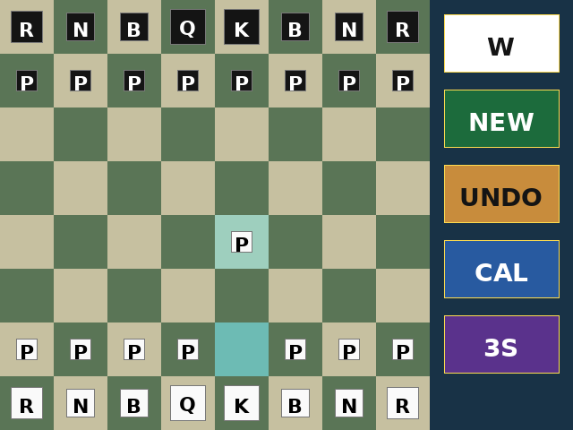

# ESP32 Chess

[](https://github.com/valleyco/esp32-chess/actions/workflows/host-tests.yml)
[](LICENSE)

Touch chess on **ESP32** + SPI TFT. You play White; the engine replies on a
FreeRTOS worker. Engine/API live in the submodule
[`esp32-chess-lib`](https://github.com/valleyco/esp32-chess-lib) (**GPL-3.0**).



## Hardware

Designed around ESP-IDF board HALs — **not** locked to one module forever.

| Status | Target |
|---|---|
| **Primary bring-up** | Classic ESP32 “CYD” class (e.g. ESP32-2432S028R, **ST7789** 320×240 + XPT2046) |
| **Planned** | Other ESP32 variants (e.g. **ESP32-C3**) and panels (e.g. **ILI9341**) |

Board notes for the current bring-up unit:
[`docs/boards/esp32-2432s028r/`](docs/boards/esp32-2432s028r/BOARD.md).
New boards should add a short pin/quirk doc under `docs/boards/`.

## Requirements

- ESP-IDF **6.x** (source `export.sh` before `make`)
- Git submodule `components/chess` →
  [`esp32-chess-lib`](https://github.com/valleyco/esp32-chess-lib)
- Host tests: `gcc` / `g++` (no IDF, no board)

## Quick start

```bash
git clone --recurse-submodules https://github.com/valleyco/esp32-chess.git
cd esp32-chess
. /path/to/esp-idf/export.sh
make test          # host: UI + chess lib
make build         # firmware
make flash monitor # default PORT=/dev/ttyUSB0
```

If you cloned without submodules: `git submodule update --init --recursive`.

Override port: `make flash PORT=/dev/ttyACM0`.

## Bring-up probes

| Target | Purpose |
|---|---|
| `make flash-esp32-lcdtest` | Orientation test card |
| `make flash-esp32-touchtest` | Finger-paint + UART raw ADC |
| `make flash-esp32-touchcalib` | Standalone 4-corner calib → NVS |

If NVS has no valid touch calib, the main app runs the wizard once at boot.
In-game **CAL** recalibrates anytime. Empty NVS falls back to factory raw ranges
until the wizard succeeds.

## How to play

1. `make flash`
2. Complete calib if prompted (or tap **CAL**)
3. Tap a White piece, then a destination square
4. Strip shows thinking; then Black moves (teal last-move highlight)

### Strip (right band)

| Band | Action |
|---|---|
| Top | Side to move (amber = thinking; red = mate; blue = stalemate) |
| NEW | New game |
| UNDO | Undo last human + engine pair |
| CAL | 4-corner calibration |
| TIME | Think time **1 s → 3 s → 5 s** |

**Promotion:** strip becomes Q / R / B / N. Squares use engine index
**a8 = 0 … h1 = 63**.

## Host tests

```bash
make test           # all
make test-chess     # esp32-chess-lib
make test-ui        # geom / dirty / FSM / calib math
make bench          # depth/nodes/nps (lib)
```

Optional strength suite: `make -C components/chess bench-wac-smoke` (not in
`make test`). Engine UART search spam is off unless built with
`-DCHESS_ENGINE_SERIAL`.

## Layout

```text
components/board/   display + touch HAL, calib math/NVS/wizard
components/chess/   submodule → esp32-chess-lib (GPL engine + chess_api)
components/ui/      geom, dirty redraw, FSM, paint
host/ui/            host UI tests
main/               game loop + lcd/touch/calib probes
docs/               boards, benchmarks, screenshots
```

Board paint is **square-level dirty** (no full RGB565 framebuffer).
`chess_api` uses an internal mutex — UI should call it when the think worker is
idle (except the worker’s `chess_think`).

## License

**GPL-3.0** for this combined firmware (links the GPL engine). See
[`LICENSE`](LICENSE), [`CREDITS.md`](CREDITS.md), and
[`CONTRIBUTING.md`](CONTRIBUTING.md).

Development notes (not a user guide): [`PLAN.md`](PLAN.md).
